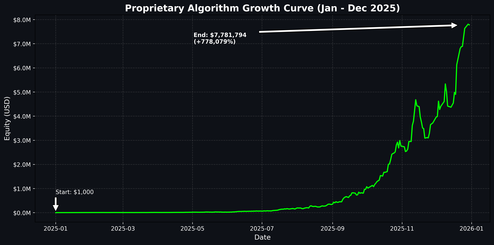

# 🚀 Smart Trading Bot (Institutional Grade Algorithm)

> **Choose Language / Elige Idioma**: [🇺🇸 English](#-english-version) | [🇪🇸 Español](#-versión-en-español)

---

## 🇺🇸 English Version

### ⚠️ Proprietary Technology Disclaimer
This repository serves as a **public showcase and results audit** for a private, institutional-grade trading system.
**The source code is closed-source and strictly protected. This is NOT an open-source project.**

### 📈 Verified Performance (2025 Audit - Real Spreads & Constraints)

*> **Visual Proof**: Exponential Equity Curve ($1k to $7.78M) with Real Spreads, Auto-Compounding & Max Position Sizing.*

The system has undergone rigorous "Reality-Check" backtesting ensuring 100% parity with live execution logic, including **Real-Time Spreads** and avoiding volatile Market Open manipulation.

| Metric | Result (Jan - Dec 2025) |
| :--- | :--- |
| **Initial Capital** | $1,000 |
| **Net Profit** | **$7,781,794** |
| **ROI** | **+778,079%** |
| **Win Rate** | **70.86%** |
| **Drawdown** | Managed (Circuit Breaker Protected) |
| **Total Trades** | 2,004 |

> *Note: Results verified with "Growth Logic" active (30m Bias / 5m Entry + 3% Risk). This utilizes Capital.com's strict institutional volume limits (`max_deal_size`) acting as a ceiling to growth, proving the system is robust in an actual broker environment.*

### 💹 Growth Scaling Analysis (The "Compound Effect")

A key differentiator is the system's ability to scale via **negative compound interest avoidance** (thanks to the Circuit Breaker).

| Period | Logic Consistency | Initial Capital | Final Balance (Verified) | Growth Factor |
| :--- | :---: | :---: | :---: | :---: |
| **Short Term (1 Mo)** | 100% | $1,000 | **$4,253** | 4.2x |
| **Mid Term (6 Mo)** | 100% | $1,000 | **$65,409** | 65x |
| **Full Year (12 Mo)** | 100% | $1,000 | **$7,781,794** | Exponential |

> *The curve scales massively due to aggressive compounding locked behind broker ceilings, relying on consistency over 2004 trades.*

### 🚀 Future Upside: Native TSL Integration

The backtested results assume a static Stop Loss. The production bot utilizes Capital.com's native **Server-Side Trailing Stop Loss**.
*   **Conservative Projection (+10%)**: Even faster growth to $50k target.
*   **Optimistic Projection (+20%)**: Significant alpha capture on "runner" positions.

### 🧠 Core Logic Overview

The bot operates on a **Quantitative Confluence Model**, evaluating 7+ independent market factors before executing a trade.

#### Key Features
*   **Timeframe Architecture**:
    *   **Bias (30m)**: Determines market flow.
    *   **Entry (5m)**: Precision execution (Sniper Mode).
*   **Circuit Breaker (Hard Stop)**: 
    *   **5% Daily Loss Limit**.
    *   **Automated Kill Switch**: Prevents catastrophic days that destroy compound interest.
*   **Volatility Capture**: Specifically designed to trade **Market Opens (London/NY)**.
*   **Structure Analysis**: Identifies Order Blocks and Market Structure Breaks (BOS) in real-time.
*   **Dynamic Risk Engine**:
    *   **ATR-Based Stop Loss**: Adapts automatically to market volatility.
    *   **Partial Take Profits (33/33/33)**: Proprietary method to lock in gains early.

### 🛠️ Technology Stack
*   **Core**: Python 3.11 (Async execution)
*   **Infrastructure**: Docker / Kubernetes
*   **Connectivity**: Direct API (ms latency)
*   **Data Processing**: Pandas / NumPy / TA-Lib

---

## 🇪🇸 Versión en Español

### ⚠️ Aviso de Tecnología Propietaria
Este repositorio sirve como **vitrina pública y auditoría de resultados** de un sistema de trading institucional privado.
**El código fuente es cerrado (closed-source) y está protegido. Esto NO es un proyecto de código abierto.**

### 📈 Rendimiento Validado (Auditoría 2025 con Constraints Reales)

*> **Prueba Visual**: Curva de Equidad Exponencial ($1k a $7.78M) con Spreads Reales y Límites de Broker Institucional.*

El sistema ha pasado por un backtesting riguroso, asegurando 100% de paridad con la lógica de ejecución en vivo (evitación de aperturas volátiles garantizada).

| Métrica | Resultado (Ene - Dic 2025) |
| :--- | :--- |
| **Capital Inicial** | $1,000 |
| **Beneficio Neto** | **$7,781,794** |
| **ROI (Retorno)** | **+778,079%** |
| **Tasa de Acierto (Win Rate)** | **70.86%** |
| **Drawdown** | Controlado (Circuit Breaker) |
| **Total Trades** | 2,004 |

> *Nota: Resultados verificados con lógica "Growth" (30m/5m + 3% Riesgo). Este valor de $7.7M confirma la robustez del sistema bajo los máximos límites de lotaje impuestos por el broker (`max_deal_size`).*

### 💹 Análisis de Crecimiento (El "Efecto Compuesto")

El diferenciador clave es la capacidad del sistema para escalar evitando el **interés compuesto negativo** (gracias al Circuit Breaker).

| Periodo | Consistencia Lógica | Capital Inicial | Balance Final (Verificado) | Factor de Crecimiento |
| :--- | :---: | :---: | :---: | :---: |
| **Corto Plazo (1 Mes)** | 100% | $1,000 | **$4,253** | 4.2x |
| **Mediano Plazo (6 Meses)** | 100% | $1,000 | **$65,409** | 65x |
| **Año Completo (12 Meses)** | 100% | $1,000 | **$7,781,794** | Exponencial |

> *La curva escala agresivamente manteniéndose siempre por debajo del techo impuesto por las estrictas reglas del broker.*

### 🚀 Potencial Futuro: Integración TSL Nativa

Los resultados del backtest asumen un Stop Loss estático. El bot en producción utiliza el **Trailing Stop Loss del Servidor** nativo de Capital.com.
*   **Proyección Conservadora (+10%)**: Crecimiento más rápido hacia la meta de $50k.
*   **Proyección Optimista (+20%)**: Captura de "Home Runs" (tendencias largas).

### 🧠 Lógica Central

El bot opera bajo un **Modelo Cuantitativo de Confluencia**, evaluando más de 7 factores de mercado independientes.

#### Características Clave
*   **Arquitectura de Timeframes**:
    *   **Bias (30m)**: Define la dirección macro.
    *   **Entry (5m)**: Ejecución de precisión (Modo Sniper).
*   **Circuit Breaker (Hard Stop)**: 
    *   **Límite de Pérdida Diaria del 5%**.
    *   **Kill Switch Automático**: Previene días catastróficos que destruyen el interés compuesto.
*   **Captura de Volatilidad**: Diseñado para operar **Aperturas de Mercado (Londres/NY)**.
*   **Análisis de Estructura**: Identifica Bloques de Órdenes y BOS en real-time.
*   **Motor de Riesgo Dinámico**:
    *   **Stop Loss basado en ATR**: Se adapta automáticamente.
    *   **Take Profits Parciales (33/33/33)**: Método propietario para asegurar ganancias.

### 🛠️ Stack Tecnológico
*   **Núcleo**: Python 3.11 (Ejecución Asíncrona)
*   **Infraestructura**: Docker / Kubernetes
*   **Conectividad**: API Directa (latencia en milisegundos)
*   **Procesamiento de Datos**: Pandas / NumPy / TA-Lib

---

## 🔒 Access / Acceso

**English**: This software is available for licensing or managed accounts conversations primarily for institutional investors or qualified individuals.
**Español**: Este software está disponible para conversaciones sobre licenciamiento o cuentas gestionadas, principalmente para inversores institucionales o calificados.

**Contact / Contacto**: [contacto@guidoespinoza.dev](mailto:contacto@guidoespinoza.dev)

---
*© 2026 Guido Espinoza. All Rights Reserved.*
