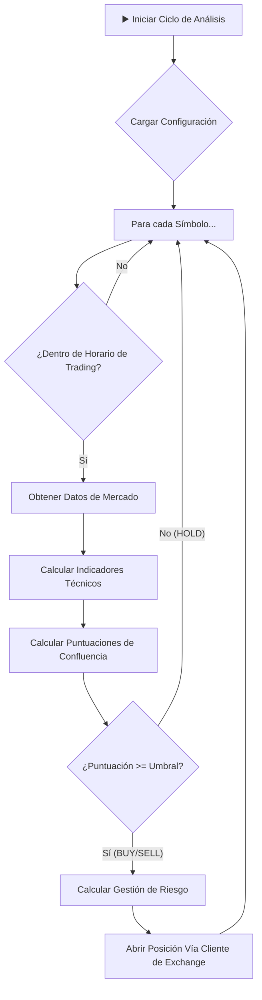

# Arquitectura del Bot de Trading

El bot está diseñado con una arquitectura modular y desacoplada, centrada en un
núcleo de decisión (`Bot`) que orquesta el resto de los componentes. El flujo de
trabajo sigue un ciclo de vida claro para cada análisis de mercado.

## Diagrama de Flujo de Decisiones

## Componentes Principales

1.  **Punto de Entrada (`main.py`)**
    - Inicia el servidor web `FastAPI` para exponer endpoints de monitoreo (ej.
      `/health`).
    - Crea e inicia una instancia única y principal del `Bot` en un hilo de
      fondo, que se convierte en el cerebro de la aplicación.

2.  **Núcleo del Bot (`src/core/bot.py`)**
    - **`Bot` class**: Es la clase principal que contiene el bucle de análisis
      (`_run_logic_loop`).
    - **Carga de Configuración**: Al iniciar, carga todas las configuraciones
      estratégicas desde `src/config/` y las credenciales desde el archivo
      `.env`.
    - **Ciclo de Análisis**: Itera sobre la lista de símbolos (`SYMBOLS`)
      definidos en la configuración.
    - **Control de Horarios**: Verifica si el momento actual está dentro de las
      franjas horarias de trading permitidas para el símbolo antes de proceder.
      Incluye una **Ventana de Cierre de Viernes** (21:55 UTC) que detiene
      nuevas entradas y cierra posiciones abiertas para evitar gaps de fin de
      semana (si `TRADE_ON_WEEKENDS=False`).
    - **Orquestación**: Llama a los componentes de indicadores y de cliente de
      trading para obtener datos y ejecutar órdenes.
    - **Gestión Activa (Hilo Paralelo)**: Ejecuta un hilo independiente
      (`_run_monitor`) que supervisa las posiciones abiertas cada 60 segundos
      para aplicar lógica de cierres parciales y trailing stops sin bloquear el
      análisis de mercado.

3.  **Configuración (`src/config/`)**
    - **`core_config.py`**: Contiene la configuración estratégica central: la
      lista de símbolos, las temporalidades, el umbral de confluencia
      (`CONFLUENCE_THRESHOLD`), el riesgo por operación y el ratio
      riesgo/beneficio.
    - **`symbols_config.py`**: Define parámetros específicos por símbolo, como
      los horarios de trading óptimos.
    - **`market_hours_config.py`**: Define los horarios de apertura y cierre de
      los mercados globales.

4.  **Indicadores y Estrategia (`src/indicators/`)**
    - **`add_all_indicators`**: Función principal que recibe un DataFrame de
      mercado y le añade todas las columnas de indicadores técnicos necesarios
      (EMAs, MACD, RSI, Ichimoku, etc.).
    - **`_calculate_confluence_scores`**: (Método privado del `Bot`) Una vez que
      los indicadores están calculados, este método los evalúa y genera una
      **puntuación alcista** y una **puntuación bajista** (de 0 a 8). Esta es la
      pieza central de la lógica de decisión.

5.  **Cliente de Trading (`src/trading_client/`)**
    - Abstrae la comunicación con los diferentes exchanges (Capital.com, Bybit).
    - Proporciona una interfaz unificada con métodos como `get_market_data`,
      `open_position`, `get_account_balance`, etc.
    - El `Bot` utiliza este cliente sin necesidad de saber a qué exchange se
      está conectando, lo que hace que el sistema sea extensible.

6.  **Utilidades (`src/utils/`)**
    - **`risk_management.py`**: Contiene la lógica crucial para
      `calculate_position_details`. Esta función toma la señal (BUY/SELL), el
      balance de la cuenta y los parámetros de riesgo para determinar el
      **tamaño de la posición (volumen)**, el precio de **Stop Loss** (basado en
      ATR) y el precio de **Take Profit**.

## Flujo de Ejecución Detallado

1.  El `Bot` se inicia y carga su configuración.
2.  Entra en un bucle infinito que se ejecuta cada pocos minutos.
3.  Dentro del bucle, itera sobre cada `símbolo` de la lista.
4.  Verifica si es un buen momento para operar ese `símbolo` según
    `symbols_config.py`.
5.  Si es así, solicita los datos de mercado para la `temporalidad` principal a
    través del `trading_client`.
6.  Pasa los datos a `add_all_indicators` para enriquecer el DataFrame.
7.  El `Bot` calcula las puntuaciones de confluencia (alcista y bajista) a
    partir del DataFrame enriquecido.
8.  Compara las puntuaciones con `CONFLUENCE_THRESHOLD`.
    - Si ninguna puntuación alcanza el umbral, la decisión es `HOLD` y pasa al
      siguiente símbolo.
    - Si una puntuación supera el umbral, se genera una señal de `BUY` o `SELL`.
9.  Con una señal válida, llama a `calculate_position_details` para obtener los
    parámetros exactos de la operación (volumen, SL, TP).
10. Finalmente, utiliza el `trading_client` para enviar la orden de
    `open_position` al exchange con todos los detalles calculados.
11. El ciclo se repite.
